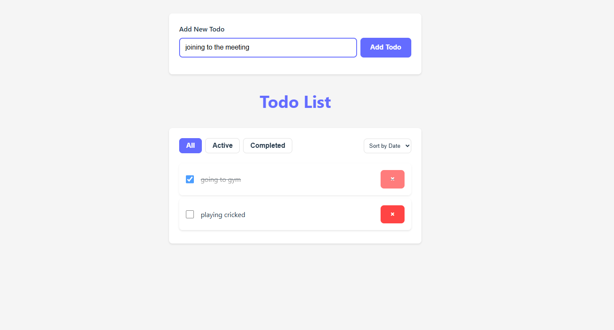

# Modern Todo App with React

A sleek, modern todo application built with React, featuring a clean UI and advanced functionality.



## Features

- ✨ Modern, clean UI design
- 📱 Responsive layout
- ✅ Add, complete, and delete todos
- 🔍 Filter todos (All, Active, Completed)
- 📊 Sort todos by title or date
- 💾 Local storage persistence
- 🎨 Beautiful animations and transitions
- 📱 Mobile-friendly design

## Technologies Used

- React
- CSS3 (Custom styling with modern features)
- Local Storage API

## Getting Started

1. Clone the repository:
```bash
git clone https://github.com/yourusername/todo-react.git
```

2. Install dependencies:
```bash
cd todo-react
npm install
```

3. Start the development server:
```bash
npm run dev
```

4. Open [http://localhost:5173](http://localhost:5173) to see the app.

## Project Structure

```
src/
├── App.jsx           # Main application component
├── NewTodoForm.jsx   # Form component for adding new todos
├── TodoList.jsx      # List component for displaying todos
└── main.jsx          # Application entry point
```

## Features in Detail

### Todo Management
- Add new todos with a clean, focused input
- Mark todos as complete/incomplete
- Delete todos with a single click
- Automatic saving to local storage

### Filtering and Sorting
- Filter todos by status (All, Active, Completed)
- Sort todos by title or creation date
- Real-time updates as you filter and sort

### UI/UX Features
- Smooth animations and transitions
- Responsive design for all screen sizes
- Clear visual feedback for user actions
- Modern, minimalist design
- Accessible form controls and buttons

## Contributing

Contributions are welcome! Please feel free to submit a Pull Request.

## License

This project is licensed under the MIT License - see the LICENSE file for details.

## Acknowledgments

- Built with React
- Styled with modern CSS
- Inspired by modern todo applications

## Author

👤 **Rezwanullah Quraishi**

- LinkedIn: [Click here](https://www.linkedin.com/in/rezwanullah-quraishi-608314260/)
